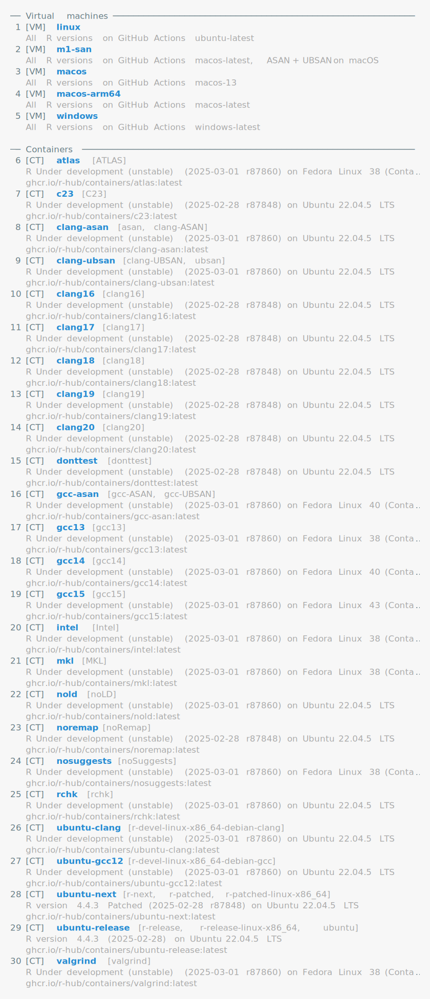
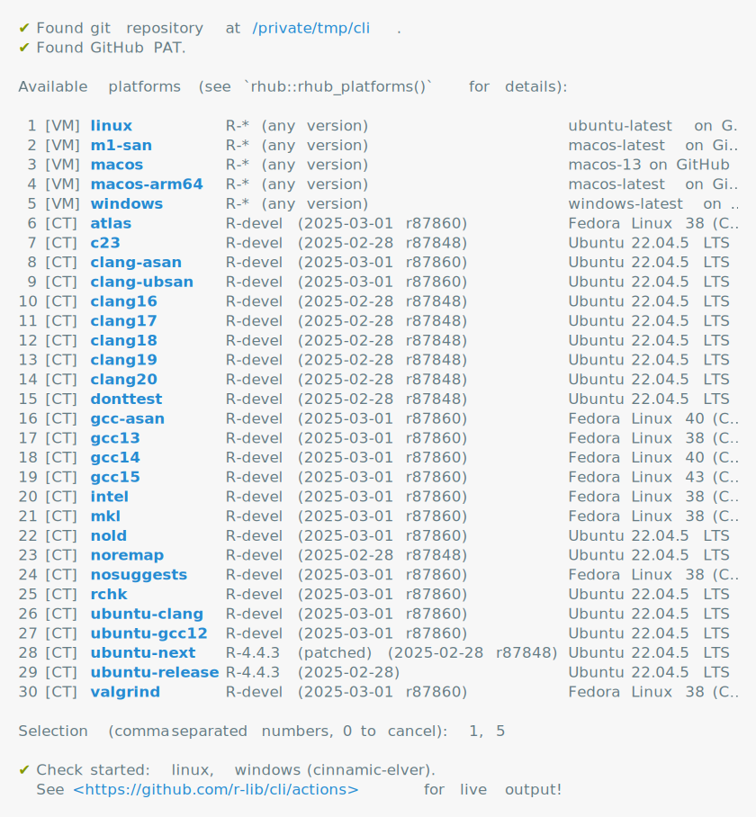

<!-- README.md is generated from README.Rmd. Please edit that file -->

# rhub2

> R-hub version 2

<!-- badges: start -->
[](https://lifecycle.r-lib.org/articles/stages.html#experimental)
[](https://github.com/r-hub/rhub2/actions/workflows/R-CMD-check.yaml)
[](https://www.r-pkg.org/pkg/rhub2)
[](https://app.codecov.io/gh/r-hub/rhub2?branch=main)
<!-- badges: end -->

R-hub 2 uses GitHub Actions to run `R CMD check` and similar package checks.
The rhub2 package helps you set up R-hub 2 for your R package, and start
running checks.

---

- <a href="#installation" id="toc-installation">Installation</a>
- <a href="#usage" id="toc-usage">Usage</a>
  - <a href="#requirements" id="toc-requirements">Requirements</a>
  - <a href="#private-repositories" id="toc-private-repositories">Private
    repositories</a>
  - <a href="#setup" id="toc-setup">Setup</a>
  - <a href="#run-checks" id="toc-run-checks">Run checks</a>
- <a href="#code-of-conduct" id="toc-code-of-conduct">Code of Conduct</a>
- <a href="#license" id="toc-license">License</a>

## Installation

Install the stable version from CRAN:

``` r
install.packages("rhub2")
```

## Usage

### Requirements

- A Github account.
- Your R package must be in a GitHub repository.
- You need a GitHub [Personal Access
  Token](https://docs.github.com/en/authentication/keeping-your-account-and-data-secure/creating-a-personal-access-token).
  You can use the [gitcreds package](https://gitcreds.r-lib.org/) to add
  the token to the git credential store.

### Private repositories

rhub2 uses GitHub Actions, which is free for public repositories. For
private repositories you also get some minutes for free, depending on
the GitHub subscription you have. See [About billing for GitHub
Actions](https://docs.github.com/en/billing/managing-billing-for-github-actions/about-billing-for-github-actions)
for details.

### Setup

1.  Switch to the directory of your package, and call
    `rhub2::rhub_setup()` to add the R-hub workflow file to your
    package.

``` r
rhub2::rhub_setup()
```

<picture>
<source media="(prefers-color-scheme: dark)" srcset="man/figures/rhub-setup-dark.svg">
 </picture>

2.  Run `git commit` and `git push` to push the workflow file to GitHub.

3.  Run `rhub2::rhub_doctor()` to check if everything is set up
    correctly:

``` r
rhub2::rhub_doctor()
```

<picture>
<source media="(prefers-color-scheme: dark)" srcset="man/figures/rhub-doctor-dark.svg">
 </picture>

### Run checks

Use `rhub2::rhub_platforms()` to get a list of supported platforms and
checks:

``` r
rhub2::rhub_platforms()
```

<picture>
<source media="(prefers-color-scheme: dark)" srcset="man/figures/rhub-platforms-dark.svg">
 </picture>

Run `rhub2::rhub_check()` to start R-hub 2 checks on GitHub Actions:

``` r
rhub2::rhub_check()
```

<picture>
<source media="(prefers-color-scheme: dark)" srcset="man/figures/rhub-check-dark.svg">
 </picture>

## Code of Conduct

Please note that the callr project is released with a [Contributor Code
of Conduct](https://callr.r-lib.org/CODE_OF_CONDUCT.html). By
contributing to this project, you agree to abide by its terms.

## License

MIT © R Consortium
